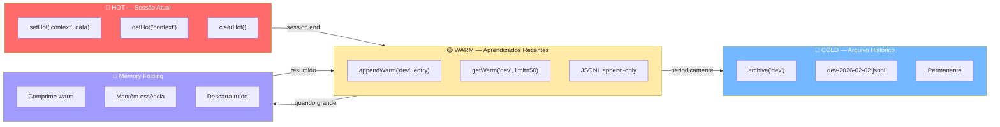

# Diagrama 7: Memória — 3 Camadas

```mermaid
flowchart LR
    subgraph HOT["🔴 HOT — Sessão Atual"]
        H1["setHot('context', data)"]
        H2["getHot('context')"]
        H3["clearHot()"]
    end

    subgraph WARM["🟡 WARM — Aprendizados Recentes"]
        W1["appendWarm('dev', entry)"]
        W2["getWarm('dev', limit=50)"]
        W3["JSONL append-only"]
    end

    subgraph COLD["🔵 COLD — Arquivo Histórico"]
        C1["archive('dev')"]
        C2["dev-2026-02-02.jsonl"]
        C3["Permanente"]
    end

    subgraph FOLD["🔄 Memory Folding"]
        F1["Comprime warm"]
        F2["Mantém essência"]
        F3["Descarta ruído"]
    end

    HOT -->|"session end"| WARM
    WARM -->|"periodicamente"| COLD
    WARM -->|"quando grande"| FOLD
    FOLD -->|"resumido"| WARM

    style HOT fill:#ff6b6b,color:#fff
    style WARM fill:#ffeaa7,color:#333
    style COLD fill:#74b9ff,color:#fff
    style FOLD fill:#a29bfe,color:#fff
```

---
