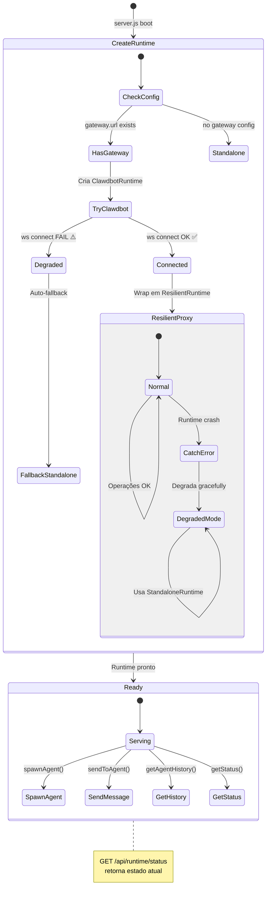

# Diagrama 10: Runtime Layer — Fallback Resiliente

```mermaid
stateDiagram-v2
    [*] --> CreateRuntime: server.js boot

    state CreateRuntime {
        [*] --> CheckConfig
        CheckConfig --> HasGateway: gateway.url exists
        CheckConfig --> Standalone: no gateway config

        HasGateway --> TryClawdbot: Cria ClawdbotRuntime
        TryClawdbot --> Connected: ws connect OK ✅
        TryClawdbot --> Degraded: ws connect FAIL ⚠️

        Connected --> ResilientProxy: Wrap em ResilientRuntime
        Degraded --> FallbackStandalone: Auto-fallback

        state ResilientProxy {
            [*] --> Normal
            Normal --> Normal: Operações OK
            Normal --> CatchError: Runtime crash
            CatchError --> DegradedMode: Degrada gracefully
            DegradedMode --> DegradedMode: Usa StandaloneRuntime
        }
    }

    CreateRuntime --> Ready: Runtime pronto

    state Ready {
        [*] --> Serving
        Serving --> SpawnAgent: spawnAgent()
        Serving --> SendMessage: sendToAgent()
        Serving --> GetHistory: getAgentHistory()
        Serving --> GetStatus: getStatus()
    }

    note right of Ready
        GET /api/runtime/status
        retorna estado atual
    end note
```

---

*Raio-X v2.1 — Auditado e ilustrado com Mermaid — Gerado em 2026-02-02 por Claudio*
