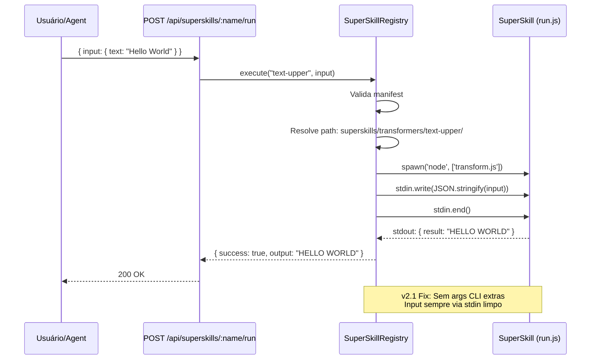

# Diagrama 8: SuperSkills — Fluxo de Execução

```mermaid
sequenceDiagram
    participant U as Usuário/Agent
    participant API as POST /api/superskills/:name/run
    participant REG as SuperSkillRegistry
    participant SK as SuperSkill (run.js)

    U->>API: { input: { text: "Hello World" } }
    API->>REG: execute("text-upper", input)
    REG->>REG: Valida manifest
    REG->>REG: Resolve path: superskills/transformers/text-upper/
    REG->>SK: spawn('node', ['transform.js'])
    REG->>SK: stdin.write(JSON.stringify(input))
    REG->>SK: stdin.end()
    SK-->>REG: stdout: { result: "HELLO WORLD" }
    REG-->>API: { success: true, output: "HELLO WORLD" }
    API-->>U: 200 OK

    Note over REG,SK: v2.1 Fix: Sem args CLI extras<br/>Input sempre via stdin limpo
```

---
