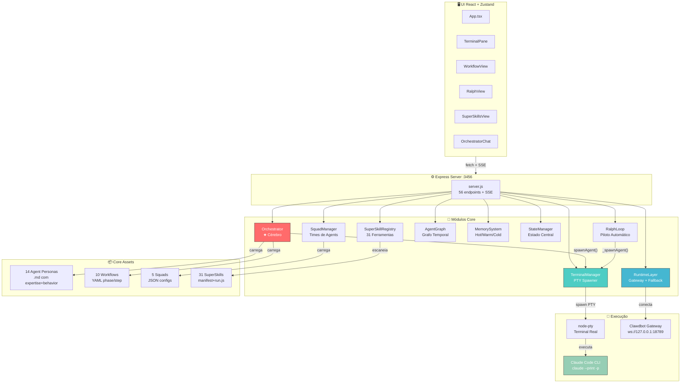

# Diagrama 1: Arquitetura Geral do Sistema

```mermaid
graph TB
    subgraph UI["🖥️ UI React + Zustand"]
        App["App.tsx"]
        Terminal["TerminalPane"]
        Workflow["WorkflowView"]
        Ralph["RalphView"]
        Skills["SuperSkillsView"]
        Chat["OrchestratorChat"]
    end

    subgraph Server["⚙️ Express Server :3456"]
        SRV["server.js<br/>56 endpoints + SSE"]
    end

    subgraph Core["🧠 Módulos Core"]
        ORC["Orchestrator<br/>★ Cérebro"]
        TM["TerminalManager<br/>PTY Spawner"]
        SM["SquadManager<br/>Times de Agents"]
        RL["RalphLoop<br/>Piloto Automático"]
        AG["AgentGraph<br/>Grafo Temporal"]
        MEM["MemorySystem<br/>Hot/Warm/Cold"]
        ST["StateManager<br/>Estado Central"]
        SS["SuperSkillRegistry<br/>31 Ferramentas"]
        RT["RuntimeLayer<br/>Gateway + Fallback"]
    end

    subgraph Assets["📦 Core Assets"]
        AGENTS["14 Agent Personas<br/>.md com expertise+behavior"]
        WF["10 Workflows<br/>YAML phase/step"]
        SQ["5 Squads<br/>JSON configs"]
        SK["31 SuperSkills<br/>manifest+run.js"]
    end

    subgraph Execution["🚀 Execução"]
        CLI["Claude Code CLI<br/>claude --print -p"]
        PTY["node-pty<br/>Terminal Real"]
        GW["Clawdbot Gateway<br/>ws://127.0.0.1:18789"]
    end

    UI -->|"fetch + SSE"| Server
    SRV --> ORC
    SRV --> TM
    SRV --> SM
    SRV --> RL
    SRV --> AG
    SRV --> MEM
    SRV --> ST
    SRV --> SS
    SRV --> RT

    ORC -->|"carrega"| AGENTS
    ORC -->|"carrega"| WF
    SM -->|"carrega"| SQ
    SS -->|"escaneia"| SK

    ORC -->|"spawnAgent()"| TM
    RL -->|"_spawnAgent()"| TM
    TM -->|"spawn PTY"| PTY
    PTY -->|"executa"| CLI
    RT -->|"conecta"| GW

    style ORC fill:#ff6b6b,stroke:#333,color:#fff
    style TM fill:#4ecdc4,stroke:#333,color:#fff
    style RT fill:#45b7d1,stroke:#333,color:#fff
    style CLI fill:#96ceb4,stroke:#333,color:#fff
```

---
