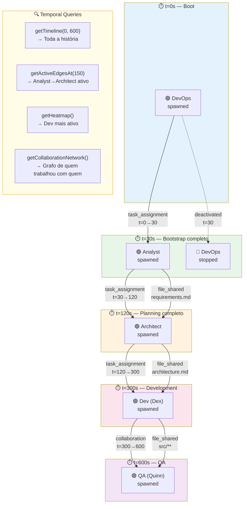

# Diagrama 6: Grafo Temporal — Como Interações São Rastreadas

```mermaid
graph TD
    subgraph T0["⏱️ t=0s — Boot"]
        N1["🟢 DevOps<br/>spawned"]
    end

    subgraph T30["⏱️ t=30s — Bootstrap completo"]
        N1 -->|"task_assignment<br/>t=0→30"| N2["🟢 Analyst<br/>spawned"]
        N1 -.->|"deactivated<br/>t=30"| N1X["🔴 DevOps<br/>stopped"]
    end

    subgraph T120["⏱️ t=120s — Planning completo"]
        N2 -->|"task_assignment<br/>t=30→120"| N3["🟢 Architect<br/>spawned"]
        N2 -->|"file_shared<br/>requirements.md"| N3
    end

    subgraph T300["⏱️ t=300s — Development"]
        N3 -->|"task_assignment<br/>t=120→300"| N4["🟢 Dev (Dex)<br/>spawned"]
        N3 -->|"file_shared<br/>architecture.md"| N4
    end

    subgraph T600["⏱️ t=600s — QA"]
        N4 -->|"collaboration<br/>t=300→600"| N5["🟢 QA (Quinn)<br/>spawned"]
        N4 -->|"file_shared<br/>src/**"| N5
    end

    subgraph Queries["🔍 Temporal Queries"]
        Q1["getTimeline(0, 600)<br/>→ Toda a história"]
        Q2["getActiveEdgesAt(150)<br/>→ Analyst→Architect ativo"]
        Q3["getHeatmap()<br/>→ Dev mais ativo"]
        Q4["getCollaborationNetwork()<br/>→ Grafo de quem trabalhou com quem"]
    end

    style T0 fill:#e3f2fd
    style T30 fill:#e8f5e9
    style T120 fill:#fff3e0
    style T300 fill:#fce4ec
    style T600 fill:#f3e5f5
    style Queries fill:#fffde7,stroke:#f9a825
```

---
