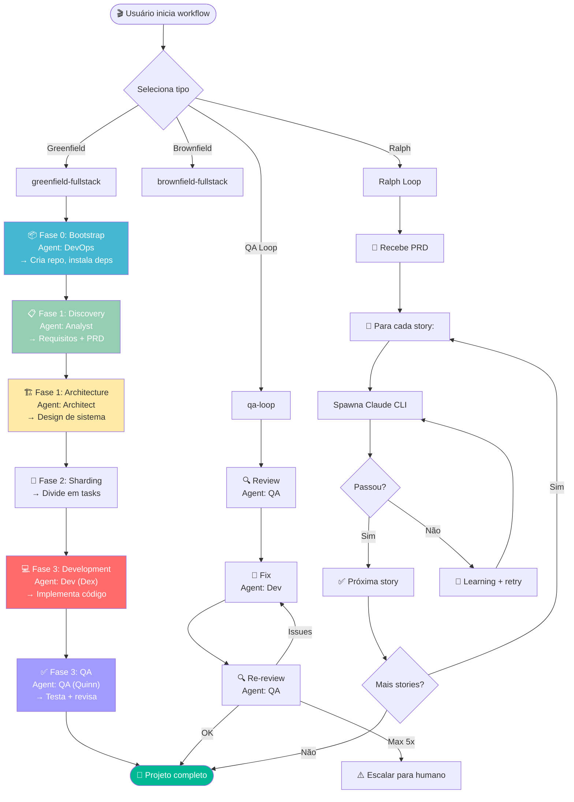

# Diagrama 4: Execução de Workflow Completo

```mermaid
flowchart TD
    START([🎬 Usuário inicia workflow]) --> SELECT{Seleciona tipo}

    SELECT -->|Greenfield| GF["greenfield-fullstack"]
    SELECT -->|Brownfield| BF["brownfield-fullstack"]
    SELECT -->|QA Loop| QA["qa-loop"]
    SELECT -->|Ralph| RA["Ralph Loop"]

    GF --> P0["📦 Fase 0: Bootstrap<br/>Agent: DevOps<br/>→ Cria repo, instala deps"]
    P0 --> P1["📋 Fase 1: Discovery<br/>Agent: Analyst<br/>→ Requisitos + PRD"]
    P1 --> P1B["🏗️ Fase 1: Architecture<br/>Agent: Architect<br/>→ Design de sistema"]
    P1B --> P2["📄 Fase 2: Sharding<br/>→ Divide em tasks"]
    P2 --> P3["💻 Fase 3: Development<br/>Agent: Dev (Dex)<br/>→ Implementa código"]
    P3 --> P3B["✅ Fase 3: QA<br/>Agent: QA (Quinn)<br/>→ Testa + revisa"]
    P3B --> DONE([🎉 Projeto completo])

    QA --> QR["🔍 Review<br/>Agent: QA"]
    QR --> QF["🔧 Fix<br/>Agent: Dev"]
    QF --> QRR["🔍 Re-review<br/>Agent: QA"]
    QRR -->|Issues| QF
    QRR -->|OK| DONE
    QRR -->|Max 5x| ESC["⚠️ Escalar para humano"]

    RA --> RA1["📝 Recebe PRD"]
    RA1 --> RA2["🔄 Para cada story:"]
    RA2 --> RA3["Spawna Claude CLI"]
    RA3 --> RA4{Passou?}
    RA4 -->|Sim| RA5["✅ Próxima story"]
    RA4 -->|Não| RA6["📝 Learning + retry"]
    RA6 --> RA3
    RA5 --> RA4B{Mais stories?}
    RA4B -->|Sim| RA2
    RA4B -->|Não| DONE

    style P0 fill:#45b7d1,color:#fff
    style P1 fill:#96ceb4,color:#fff
    style P1B fill:#ffeaa7,color:#333
    style P3 fill:#ff6b6b,color:#fff
    style P3B fill:#a29bfe,color:#fff
    style DONE fill:#00b894,color:#fff
```

---
