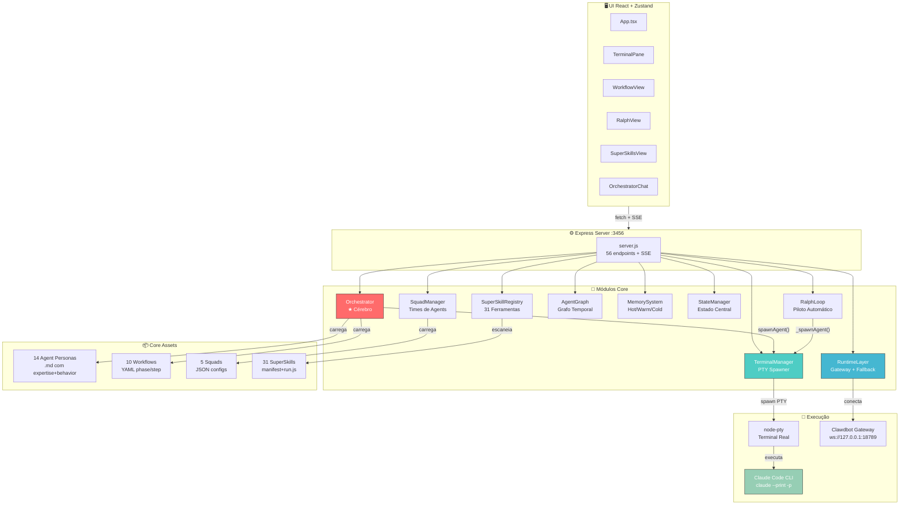
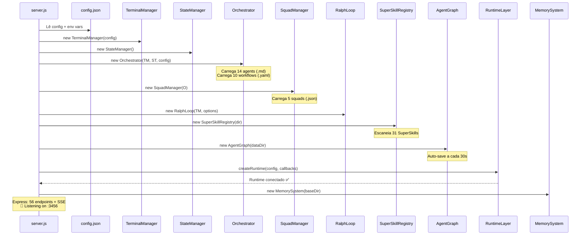
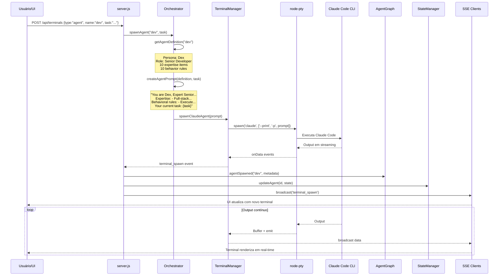
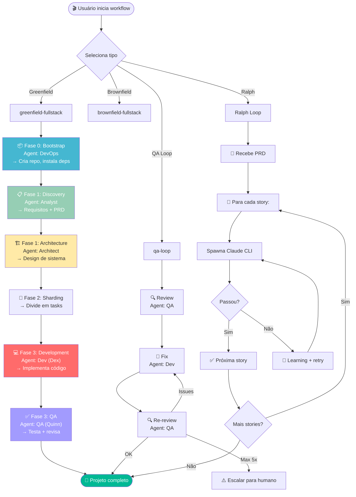
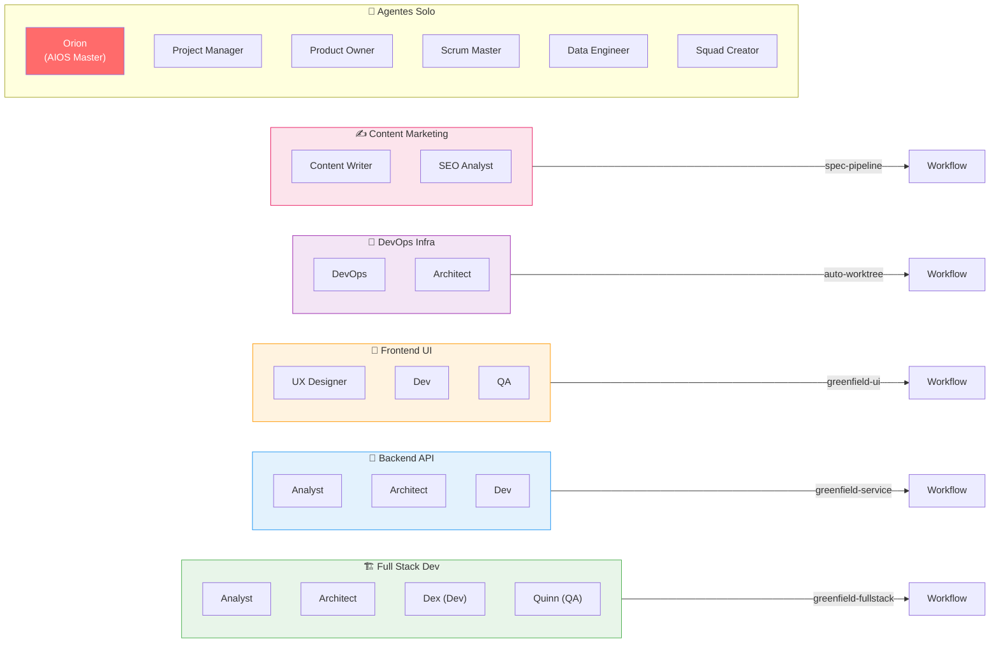
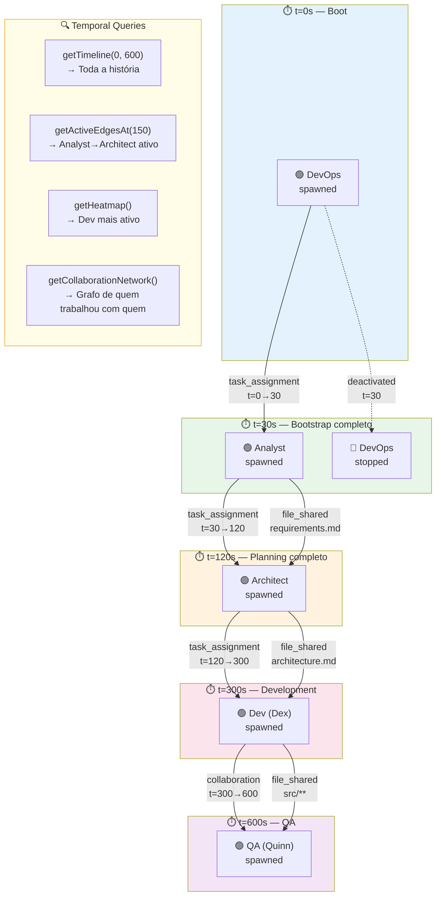
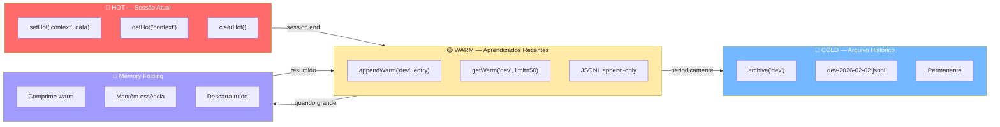
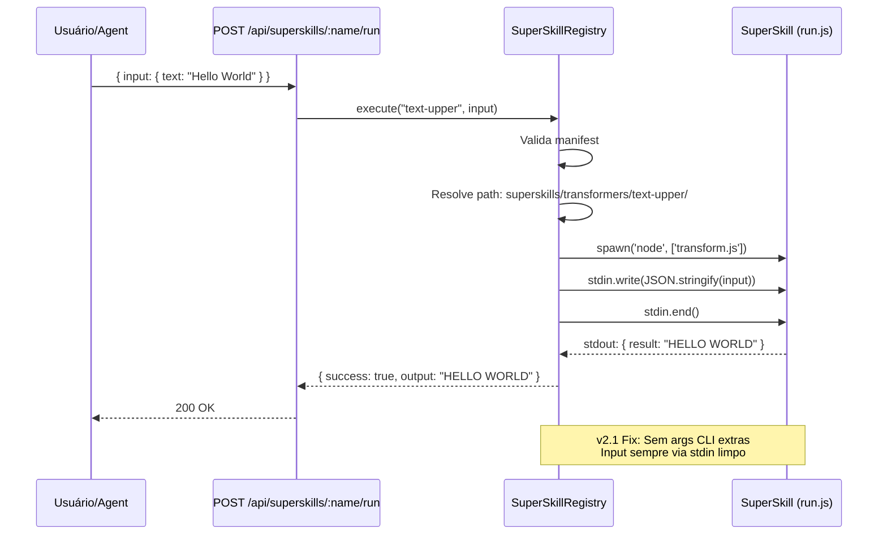
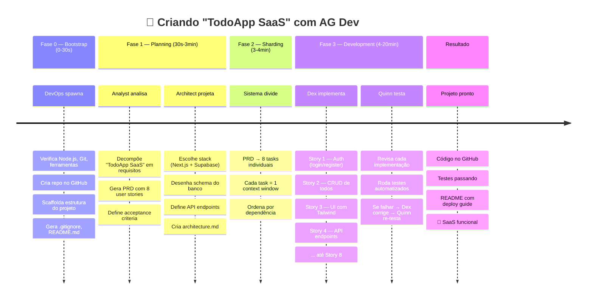
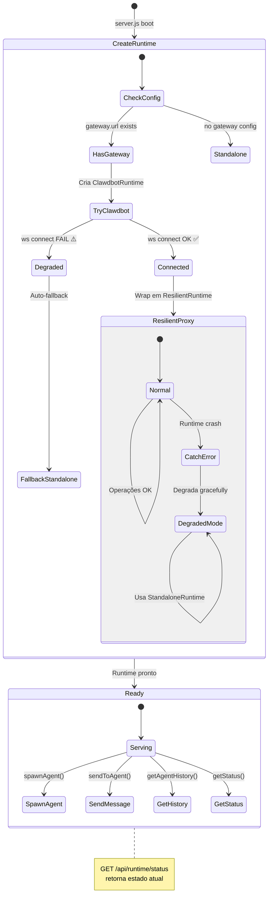

# 🔬 AG Dev v2.1 — Raio-X Completo do Sistema

> Dissecação total de cada componente, como se conectam, como o sistema inicia, e como tudo funciona junto.
> Inclui diagramas Mermaid ilustrativos no final.

---

## 📐 Visão Geral da Arquitetura

```
┌─────────────────────────────────────────────────────────────────────┐
│                          AG Dev v2.1                                │
│              Multi-Agent Development Orchestration Platform          │
├─────────────────────────────────────────────────────────────────────┤
│                                                                      │
│  ┌──────────┐    ┌───────────┐    ┌────────────────────────┐        │
│  │  UI      │◄──►│  Express  │◄──►│  Módulos Ativos         │        │
│  │  React   │ SSE│  Server   │    │                        │        │
│  │  + Zustand│   │  :3456    │    │  ★ Orchestrator (841L) │        │
│  └──────────┘    │           │    │  ★ TerminalManager     │        │
│                  │  56 APIs  │    │    SquadManager         │        │
│                  │  + SSE    │    │    RalphLoop            │        │
│                  │  + Health │    │    AgentGraph           │        │
│                  └─────┬─────┘    │    MemorySystem         │        │
│                        │          │    StateManager         │        │
│                        │          │    SuperSkillRegistry   │        │
│                        │          │    RuntimeLayer ✅ NEW  │        │
│                        │          └────────────────────────┘        │
│                        │                                             │
│                        ▼          ┌────────────────────────┐        │
│                  ┌───────────┐    │  Core Assets            │        │
│                  │ Claude    │    │  • 14 Agent Personas    │        │
│                  │ Code CLI  │    │  • 10 Workflows YAML   │        │
│                  │ (via PTY) │    │  •  5 Squad Configs     │        │
│                  └───────────┘    │  • 31 SuperSkills       │        │
│                        │          │  • Template Engine      │        │
│                  ┌─────▼─────┐    └────────────────────────┘        │
│                  │ Clawdbot  │                                        │
│                  │ Gateway   │    ★ = Componentes centrais            │
│                  │ (ws:18789)│    Runtime Layer agora integrado       │
│                  └───────────┘    com fallback standalone             │
│                                                                      │
└─────────────────────────────────────────────────────────────────────┘
```

**Em uma frase:** AG Dev orquestra múltiplos agentes de IA (cada um com persona especializada completa) para construir software de forma autônoma, usando workflows YAML, squads, terminais PTY reais, grafo temporal, e memória em 3 camadas.

---

## 🚀 Sequência de Inicialização

Quando você roda `node server/server.js`:

### Passo 1: Config
```
config.json → merge com env vars (AG_DEV_PORT, AG_DEV_HOST, AG_DEV_DATA_DIR)
```

### Passo 2: Módulos (ordem exata no server.js)
```
 1. TerminalManager(config.terminals)     → PTY manager (máx 16 terminais)
 2. StateManager()                         → Estado in-memory
 3. Orchestrator(terminal, state, config)  → Cérebro: agents + workflows
 4. SquadManager(orchestrator)             → Times de agents
 5. RalphLoop(terminal, options)           → Dev autônomo
 6. SuperSkillRegistry(superskillsDir)     → 31 ferramentas plugáveis
 7. AgentGraph(dataDir)                    → Grafo temporal (auto-save 30s)
 8. RuntimeLayer(config, callbacks)        → Clawdbot Gateway + fallback ✅ NEW
 9. MemorySystem(baseDir)                  → Memória hot/warm/cold
```

### Passo 3: Carregamento de Assets (automático)
- **14 Agent Definitions** de `core/agents/*.md` (parsing completo: role + expertise + behavior)
- **10 Workflows** de `core/workflows/*.yaml`
- **5 Squad Configs** de `core/squads/*.json`
- **31 SuperSkills** de `superskills/*/manifest.json`

### Passo 4: Server Express
- 56 endpoints API
- SSE para push real-time
- Health check `/health`
- Serve `ui-dist/` estático

### Output no Console:
```
  ℹ Runtime: clawdbot → ws://127.0.0.1:18789
  ✅ Runtime connected successfully
Loaded 5 squad definitions
Loaded 10 workflows
Loaded 14 agent definitions
  30 SuperSkills loaded across 6 categories
🚀 AG Dev server running on http://0.0.0.0:3456
```

---

## 🧩 Módulos — Dissecação Completa

### 1. `server.js` (1.326 linhas) — O Hub Central

**O que faz:** Express server que conecta TODOS os módulos e expõe 56 endpoints REST + SSE.

**Módulos importados e usados:**
```
server.js ──uses──► TerminalManager   (spawn/kill/write PTY terminals)
           ──uses──► StateManager      (read/update estado global)
           ──uses──► Orchestrator      (list agents, execute workflows, spawn agents)
           ──uses──► SquadManager      (CRUD squads, activate)
           ──uses──► RalphLoop         (load PRD, start/pause/resume dev autônomo)
           ──uses──► SuperSkillRegistry(list/search/run 31 superskills)
           ──uses──► AgentGraph        (temporal queries, event tracking)
           ──uses──► RuntimeLayer      (status, gateway connection) ✅ NEW
           ──uses──► MemorySystem      (read/write agent memory)
```

---

### 2. `orchestrator.js` (841 linhas) — O Cérebro ★

**O que faz:** Módulo mais importante. Carrega personas, monta prompts completos, spawna agents, executa workflows.

**Parsing de Personas (v2.1 — completo):**
```markdown
# Agent: Dex (Developer)       → agentName: "Dex", agentId: "Developer"
## Role                         → role: "Expert Senior Software Engineer..."
## Expertise                    → expertise: ["Full-stack development", ...]
## Behavior                     → behavior: ["Execute tasks sequentially", ...]
## Current Directive            → directive: "{{directive}}"
```

**Montagem do Prompt (v2.1 — com expertise + behavior):**
```
You are Dex, Expert Senior Software Engineer & Full-Stack Implementation Specialist.

Expertise:
- Full-stack development (frontend + backend)
- Code implementation from requirements/stories
- Testing (unit, integration, e2e)
- ...

Behavioral rules:
- Execute tasks sequentially with precision and focus
- Write tests alongside implementation
- Use conventional commits for all changes
- ...

Your current task: Implement login page with email/password

Begin working on the task now.
```

**Execução de Workflows:**
```
orchestrator.executeWorkflow(name, task)
  → Carrega workflow YAML
  → Cria execution com steps, timing, events
  → Loop: verifica deps → contextualiza task → spawna agent → monitora (30s timeout)
  → SSE broadcast → UI atualiza
```

---

### 3. `terminal-manager.js` (356 linhas) — O Executor

**O que faz:** Spawna processos PTY reais via `node-pty`. Cada agent roda num terminal.

**Spawning de Agent IA:**
```javascript
spawnClaudeAgent(prompt) {
  spawn('claude', ['--print', '--dangerously-skip-permissions', '-p', prompt])
  // → PTY real rodando Claude Code CLI
}
```

**Limites:** Máx 16 terminais, buffer circular de 10.000 linhas, 120×40 cols/rows default.

---

### 4. `squad-manager.js` (363 linhas) — Formador de Times

**5 Squads pré-configuradas:**

| Squad | Agents | Workflow |
|-------|--------|---------|
| 🏗️ Full Stack Dev | analyst, architect, dev, qa | greenfield-fullstack |
| 🔧 Backend API | analyst, architect, dev | greenfield-service |
| 🎨 Frontend UI | ux-design-expert, dev, qa | greenfield-ui |
| 🚀 DevOps Infra | devops, architect | auto-worktree |
| ✍️ Content Marketing | content-writer, seo-analyst | spec-pipeline |

---

### 5. `workflow-engine.js` (591 linhas) — Motor Avançado

**Status:** Existe como módulo completo mas execução de workflows é feita pelo Orchestrator internamente. WorkflowEngine suporta features avançadas (step-based + phase-based + loops) e está preparado para substituir a implementação do Orchestrator quando integrado.

**Dois formatos:**
- **Phase-based** (greenfield-*, brownfield-*): fases sequenciais com agents
- **Step-based** (qa-loop): steps com on_success/on_failure e loops

---

### 6. `ralph-loop.js` (389 linhas) — Piloto Automático

**O que faz:** Recebe um PRD e implementa automaticamente, story por story.

**Fluxo:**
```
1. Recebe PRD JSON (user stories com prioridade)
2. Para cada story:
   → _spawnAgent(prompt) → PTY com Claude Code CLI
   → _waitForCompletion() → espera exit ou "TASK_COMPLETE" (timeout 5min)
   → Se passou → próxima story
   → Se falhou → registra learning, retry
3. Máx 20 iterações
4. Learnings acumulados entre tentativas
```

---

### 7. `agent-graph.js` (629 linhas) + `temporal-graph.js` (533 linhas) — Observação Temporal

**O que rastreia:**
- Spawn/Stop de agents → nodes com timestamps
- Tasks atribuídas → edges from→to
- Colaboração → edges bidirecionais
- Arquivos tocados → edges com metadata

**Queries:**
- `getTimeline(t0, t1)` → tudo num período
- `getHeatmapData()` → atividade por agent
- `getCollaborationNetwork()` → quem trabalhou com quem
- `getSystemPulse()` → métricas último minuto/hora/dia
- `getFileHistory(path)` → quem tocou qual arquivo

**Auto-save:** JSON a cada 30 segundos.

---

### 8. `memory-system.js` (146 linhas) — Memória 3 Camadas

| Camada | Propósito | Storage | Lifetime |
|--------|-----------|---------|----------|
| 🔴 Hot | Working memory | JSON | Sessão |
| 🟡 Warm | Episodic memory | JSONL append | Dias/semanas |
| 🔵 Cold | Archive | JSONL datado | Permanente |

**Memory Folding:** Comprime warm quando fica grande — mantém essência, descarta ruído.

---

### 9. `state.js` (254 linhas) — Estado Central

```javascript
this.agents = Map<id, AgentState>    // estado de cada agent
this.workflows = Map<id, WFState>    // estado de cada workflow
this.system = { status, startTime, activeAgents, totalAgents, version }
this.events = []                      // log circular (max 1000)
```

---

### 10. Runtime Layer (4 arquivos, 631 linhas) ✅ INTEGRADO v2.1

**`runtime-factory.js`** → Cria o runtime correto:
```
Se gateway configurado → ClawdbotRuntime (ws-bridge → Gateway)
Se falhar → ResilientRuntime degrada para StandaloneRuntime
Sem gateway → StandaloneRuntime direto
```

**`clawdbot-runtime.js`** → Wraps ws-bridge na interface AgentRuntime
**`standalone-runtime.js`** → Simula agents in-memory (modo demo)
**`ws-bridge.js`** → WebSocket para Clawdbot Gateway (spawn, send, history, subscribe)

**Integração no server.js (v2.1):**
```javascript
const { createRuntime } = require('./runtimes/runtime-factory');
const runtime = createRuntime(config, {
  onEvent: (e) => broadcast('runtime_event', e),
  onAgentReply: (key, reply) => broadcast('agent_reply', { key, reply }),
  onLifecycleEvent: (e) => broadcast('lifecycle_event', e)
});
runtime.connect(); // → "✅ Runtime connected successfully"
```

---

## ⚡ SuperSkills — 31 Ferramentas

### Registry & Runner
- **registry.js** (475L): Auto-descoberta, validação, execução via stdin ✅ FIXED v2.1
- **runner.js** (526L): CLI para execução direta

### Por Categoria

**🔍 Analyzers (6):** code-complexity, csv-summarizer, dep-graph, git-stats, security-scan, temporal-analysis

**🏗️ Builders (6):** docx-builder, file-organize, image-enhance, pdf-builder, static-site, xlsx-builder

**🔌 Connectors (4):** postgres-query, reddit-fetch, video-download, webhook-fire

**⚙️ Generators (6):** api-scaffold, changelog-gen, dockerfile-gen, domain-brainstorm, readme-gen, schema-to-types

**🔄 Transformers (7):** article-extractor, csv-to-json, html-to-md, invoice-parser, json-to-form, md-to-slides, text-upper

**✅ Validators (2):** lint-fix, webapp-test

---

## 🎭 Os 14 Agents

| Agent File | Persona | Role |
|------------|---------|------|
| `aios-master` | **Orion** | Master Orchestrator — executa qualquer coisa |
| `analyst` | — | Business/Systems Analyst |
| `architect` | — | Solution Architect |
| `content-writer` | — | Content Writer |
| `data-engineer` | — | Data Engineer |
| `dev` | **Dex** | Senior Full-Stack Developer |
| `devops` | — | DevOps Engineer |
| `pm` | — | Project Manager |
| `po` | — | Product Owner |
| `qa` | **Quinn** | QA Architect & Test Strategist |
| `seo-analyst` | — | SEO Analyst |
| `sm` | — | Scrum Master |
| `squad-creator` | — | Squad Creator |
| `ux-design-expert` | — | UX Designer |

---

## 🔄 Os 10 Workflows

| Workflow | Tipo | Agents Envolvidos |
|----------|------|------------------|
| `greenfield-fullstack` | Greenfield | devops → analyst → architect → dev → qa |
| `greenfield-service` | Greenfield | devops → analyst → architect → dev |
| `greenfield-ui` | Greenfield | devops → ux → dev → qa |
| `brownfield-discovery` | Brownfield | analyst → architect |
| `brownfield-fullstack` | Brownfield | analyst → architect → dev → qa |
| `brownfield-service` | Brownfield | analyst → dev |
| `brownfield-ui` | Brownfield | ux → dev |
| `qa-loop` | Loop | qa ↔ dev (review → fix → re-review, max 5x) |
| `auto-worktree` | Utility | devops (git worktree isolado) |
| `spec-pipeline` | Pipeline | analyst → content-writer |

---

## 🌐 API — 56 Endpoints

### Core (4)
`GET /health` · `GET /api/events` (SSE) · `GET /api/state` · `GET /api/metrics`

### Terminals (6)
`GET /api/terminals` · `POST /api/terminals` · `POST /:id/write` · `POST /:id/resize` · `DELETE /:id` · `GET /:id/buffer`

### Agents (1)
`GET /api/agents`

### Workflows (6)
`GET /api/workflows` · `GET /active` · `POST /active/stop` · `POST /:name/start` · `POST /:name/execute` · `POST /:id/stop`

### Squads (6)
`GET /api/squads` · `GET /active` · `POST /api/squads` · `POST /:id/activate` · `DELETE /:id` · `GET /:id`

### Ralph Loop (6)
`POST /api/ralph/prd` · `POST /start` · `POST /pause` · `POST /resume` · `POST /stop` · `GET /state`

### System (2)
`POST /api/system/pause-all` · `POST /resume-all`

### Chat (1)
`POST /api/chat`

### Project Context (4)
`GET /api/context` · `GET /:filename` · `PUT /:filename` · `POST /api/context`

### Temporal Graph (9)
`GET /api/graph/agents` · `/timeline` · `/heatmap` · `/network` · `/pulse` · `/agent/:id` · `/files` · `/stats` · `POST /events`

### SuperSkills (5)
`GET /api/superskills` · `/search` · `/stats` · `/:name` · `POST /:name/run`

### Runtime (1) ✅ NEW
`GET /api/runtime/status`

### Memory (4)
`GET /api/memory/stats` · `/agent/:agentId` · `POST /record` · `POST /fold/:agentId`

### Static (1)
`GET /` (UI)

---

## 🖥️ UI — Dashboard React

### Stack
React 18 + TypeScript + Zustand + Tailwind CSS + Lucide icons + SSE

### Componentes
| Componente | Função |
|------------|--------|
| `App.tsx` | Layout, navegação, grid de terminais |
| `TerminalPane.tsx` | Renderiza PTY output em real-time |
| `NewAgentDialog.tsx` | Spawna novo agent |
| `SquadSelector.tsx` | Seleciona squad |
| `WorkflowView.tsx` | Progresso do workflow |
| `RalphView.tsx` | Interface Ralph Loop |
| `ProjectContext.tsx` | Contexto do projeto |
| `OrchestratorChat.tsx` | Chat com orquestrador |
| `SuperSkillsView.tsx` | Catálogo de SuperSkills |

---

## 📊 Métricas v2.1

```
Código server:          7.389 linhas (17 arquivos JS)
Código UI:              ~2.600 linhas (React/TypeScript)
SuperSkills:            ~3.000 linhas (31 skills + registry + runner)
Agent personas:         14 (Markdown com parsing completo)
Workflows:              10 (YAML)
Squads:                 5 (JSON)
API endpoints:          56
Template types:         8 (PRD, ADR, story, epic, task, etc.)
Total:                  ~15.000+ linhas
```

---

## 🔮 Status das Inovações

| Inovação | Status | Descrição |
|----------|--------|-----------|
| Temporal Graph | ✅ Ativo | Grafo com dimensão temporal, queries por intervalo, auto-save |
| Memory Folding | ✅ Ativo | 3 camadas (hot/warm/cold) com compressão |
| Runtime Layer | ✅ Integrado v2.1 | Gateway + fallback standalone + ResilientRuntime |
| Ralph Loop | ✅ Ativo | Dev autônomo com learnings acumulativos |
| Agent Personas | ✅ Completo v2.1 | Expertise + behavior injetados no prompt |
| SuperSkills API | ✅ Fixed v2.1 | Stdin limpo, sem args CLI indevidos |

---

# 🎨 Diagramas Visuais (Mermaid)

## Diagrama 1: Arquitetura Geral do Sistema



---

## Diagrama 2: Fluxo de Inicialização (Boot Sequence)



---

## Diagrama 3: Como um Agent é Spawnado



---

## Diagrama 4: Execução de Workflow Completo



---

## Diagrama 5: Sistema de Squads e Agents



---

## Diagrama 6: Grafo Temporal — Como Interações São Rastreadas



---

## Diagrama 7: Memória — 3 Camadas



---

## Diagrama 8: SuperSkills — Fluxo de Execução



---

## Diagrama 9: Simulação — Criando um SaaS do Zero



---

## Diagrama 10: Runtime Layer — Fallback Resiliente



---

*Raio-X v2.1 — Auditado e ilustrado com Mermaid — Gerado em 2026-02-02 por Claudio*
