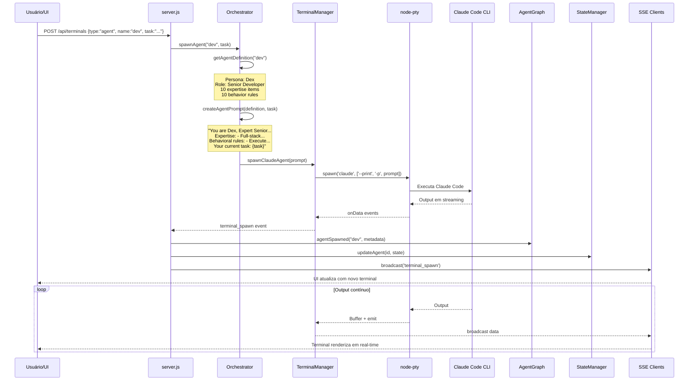

# Diagrama 3: Como um Agent é Spawnado

```mermaid
sequenceDiagram
    participant U as Usuário/UI
    participant S as server.js
    participant O as Orchestrator
    participant TM as TerminalManager
    participant PTY as node-pty
    participant CLI as Claude Code CLI
    participant AG as AgentGraph
    participant ST as StateManager
    participant SSE as SSE Clients

    U->>S: POST /api/terminals {type:"agent", name:"dev", task:"..."}
    S->>O: spawnAgent("dev", task)
    O->>O: getAgentDefinition("dev")
    Note over O: Persona: Dex<br/>Role: Senior Developer<br/>10 expertise items<br/>10 behavior rules
    O->>O: createAgentPrompt(definition, task)
    Note over O: "You are Dex, Expert Senior...<br/>Expertise: - Full-stack...<br/>Behavioral rules: - Execute...<br/>Your current task: {task}"
    O->>TM: spawnClaudeAgent(prompt)
    TM->>PTY: spawn('claude', ['--print', '-p', prompt])
    PTY->>CLI: Executa Claude Code
    CLI-->>PTY: Output em streaming
    PTY-->>TM: onData events
    TM-->>S: terminal_spawn event
    S->>AG: agentSpawned("dev", metadata)
    S->>ST: updateAgent(id, state)
    S->>SSE: broadcast('terminal_spawn')
    SSE-->>U: UI atualiza com novo terminal

    loop Output contínuo
        CLI-->>PTY: Output
        PTY-->>TM: Buffer + emit
        TM-->>SSE: broadcast data
        SSE-->>U: Terminal renderiza em real-time
    end
```

---
