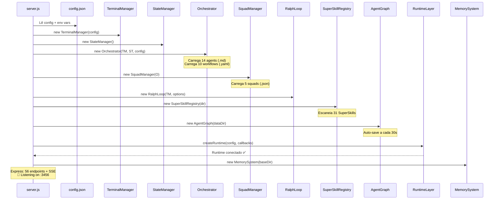

# Diagrama 2: Fluxo de Inicialização (Boot Sequence)

```mermaid
sequenceDiagram
    participant S as server.js
    participant C as config.json
    participant TM as TerminalManager
    participant ST as StateManager
    participant O as Orchestrator
    participant SM as SquadManager
    participant RL as RalphLoop
    participant SS as SuperSkillRegistry
    participant AG as AgentGraph
    participant RT as RuntimeLayer
    participant MM as MemorySystem

    S->>C: Lê config + env vars
    S->>TM: new TerminalManager(config)
    S->>ST: new StateManager()
    S->>O: new Orchestrator(TM, ST, config)
    Note over O: Carrega 14 agents (.md)<br/>Carrega 10 workflows (.yaml)
    S->>SM: new SquadManager(O)
    Note over SM: Carrega 5 squads (.json)
    S->>RL: new RalphLoop(TM, options)
    S->>SS: new SuperSkillRegistry(dir)
    Note over SS: Escaneia 31 SuperSkills
    S->>AG: new AgentGraph(dataDir)
    Note over AG: Auto-save a cada 30s
    S->>RT: createRuntime(config, callbacks)
    RT-->>S: Runtime conectado ✅
    S->>MM: new MemorySystem(baseDir)
    Note over S: Express: 56 endpoints + SSE<br/>🚀 Listening on :3456
```

---
