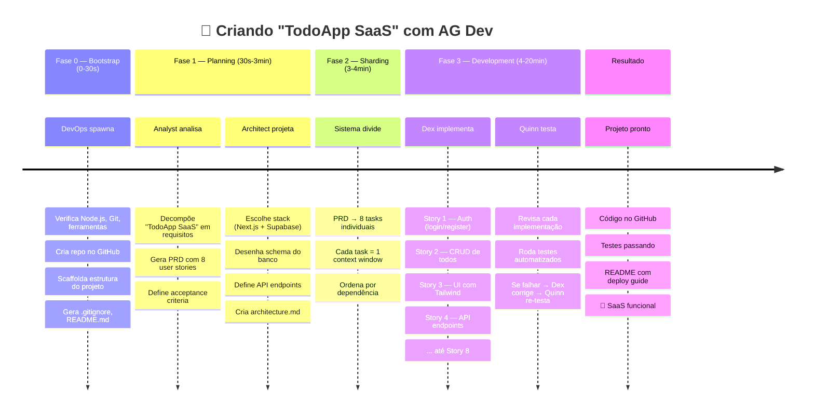

# Diagrama 9: Simulação — Criando um SaaS do Zero

```mermaid
timeline
    title 🚀 Criando "TodoApp SaaS" com AG Dev

    section Fase 0 — Bootstrap (0-30s)
        DevOps spawna : Verifica Node.js, Git, ferramentas
                      : Cria repo no GitHub
                      : Scaffolda estrutura do projeto
                      : Gera .gitignore, README.md

    section Fase 1 — Planning (30s-3min)
        Analyst analisa : Decompõe "TodoApp SaaS" em requisitos
                        : Gera PRD com 8 user stories
                        : Define acceptance criteria
        Architect projeta : Escolhe stack (Next.js + Supabase)
                          : Desenha schema do banco
                          : Define API endpoints
                          : Cria architecture.md

    section Fase 2 — Sharding (3-4min)
        Sistema divide : PRD → 8 tasks individuais
                       : Cada task = 1 context window
                       : Ordena por dependência

    section Fase 3 — Development (4-20min)
        Dex implementa : Story 1 — Auth (login/register)
                       : Story 2 — CRUD de todos
                       : Story 3 — UI com Tailwind
                       : Story 4 — API endpoints
                       : ... até Story 8
        Quinn testa : Revisa cada implementação
                    : Roda testes automatizados
                    : Se falhar → Dex corrige → Quinn re-testa

    section Resultado
        Projeto pronto : Código no GitHub
                       : Testes passando
                       : README com deploy guide
                       : 🎉 SaaS funcional
```

---
