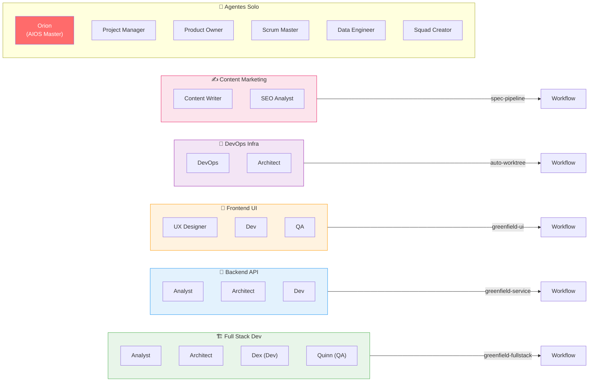

# Diagrama 5: Sistema de Squads e Agents

```mermaid
graph LR
    subgraph FS["🏗️ Full Stack Dev"]
        FS_AN["Analyst"]
        FS_AR["Architect"]
        FS_DEV["Dex (Dev)"]
        FS_QA["Quinn (QA)"]
    end

    subgraph BE["🔧 Backend API"]
        BE_AN["Analyst"]
        BE_AR["Architect"]
        BE_DEV["Dev"]
    end

    subgraph FE["🎨 Frontend UI"]
        FE_UX["UX Designer"]
        FE_DEV["Dev"]
        FE_QA["QA"]
    end

    subgraph DO["🚀 DevOps Infra"]
        DO_DEV["DevOps"]
        DO_AR["Architect"]
    end

    subgraph CM["✍️ Content Marketing"]
        CM_CW["Content Writer"]
        CM_SEO["SEO Analyst"]
    end

    subgraph SOLO["🎯 Agentes Solo"]
        ORION["Orion<br/>(AIOS Master)"]
        PM["Project Manager"]
        PO["Product Owner"]
        SM_A["Scrum Master"]
        DE["Data Engineer"]
        SC["Squad Creator"]
    end

    FS -->|greenfield-fullstack| WF1["Workflow"]
    BE -->|greenfield-service| WF2["Workflow"]
    FE -->|greenfield-ui| WF3["Workflow"]
    DO -->|auto-worktree| WF4["Workflow"]
    CM -->|spec-pipeline| WF5["Workflow"]

    style ORION fill:#ff6b6b,color:#fff
    style FS fill:#e8f5e9,stroke:#4caf50
    style BE fill:#e3f2fd,stroke:#2196f3
    style FE fill:#fff3e0,stroke:#ff9800
    style DO fill:#f3e5f5,stroke:#9c27b0
    style CM fill:#fce4ec,stroke:#e91e63
```

---
